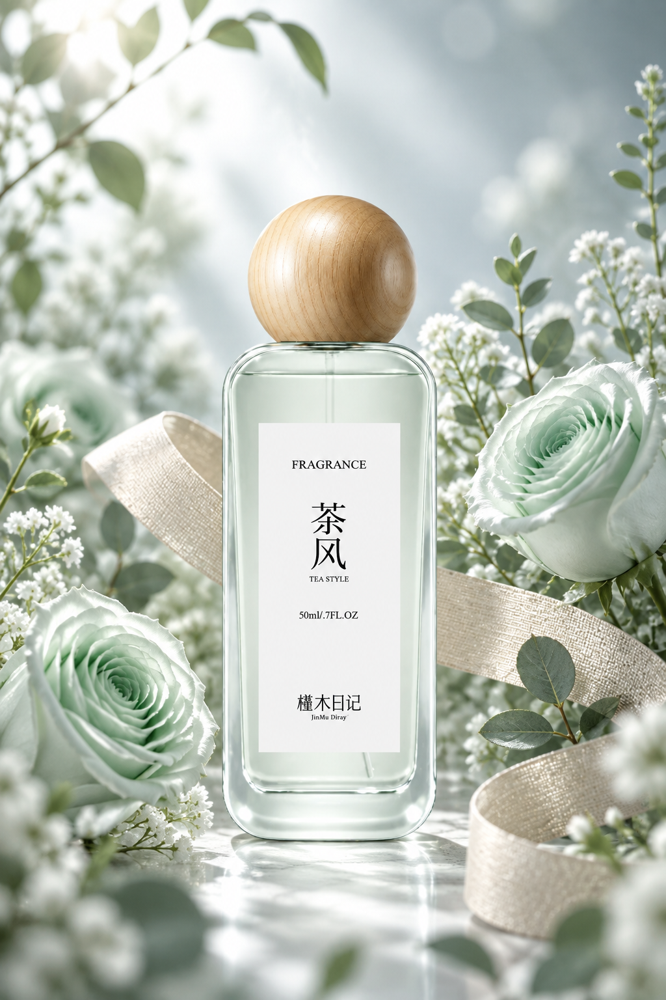

# wangge-gpt-image-2-5

[简体中文](README.md) · English

**Copy-ready prompts for GPT Image 2.5, with a focus on ecommerce and creative image editing.**

Explore 99 base prompts (78 adapted cards, 14 originals and 7 prompts developed from documented 2.5 examples), plus 111 complete variations. The collection includes 22 general templates, 30 ecommerce scenarios and 31 curated creative prompts. Ecommerce templates offer 86 variations, from clean product shots to seasonal campaigns.

[Filterable gallery](https://wangge-dev.github.io/wangge-gpt-image-2-5/browse/): search by task, product category, reference-image requirements and available results.

## Explore

| Create | Start here |
| --- | --- |
| Product photos, campaigns, packaging and detail pages | [Ecommerce collection](ecommerce/README.md) |
| Posters, infographics, portraits, branding, spaces and interfaces | [Prompt index](prompts/README.md) |
| Hairstyle grids, enamel pins and miniature ads | [Creative gallery](gallery/README.md) |
| Copy edits, localization and consistent product series | [Original workflows](experiments/README.md) |
| Prompts based on documented 2.5 examples | [Seven complete Chinese prompts](cases/README.md) |
| Try the three featured examples in ChatGPT | [Bilingual prompts](guides/web-examples.md) |

Most individual cards are in Chinese. The featured examples include complete English prompts.

## Featured results

Generated by wangge-dev in ChatGPT web. [Chinese and English prompts](guides/web-examples.md).

| Twelve hairstyles | Travel enamel pin | Mint rose perfume |
| --- | --- | --- |
|  |  |  |

## How to use

1. Open a prompt card and upload the reference images it calls for.
2. Replace the `{{variables}}` with your own details and approved text.
3. Paste the full prompt into ChatGPT image generation or another tool offering GPT Image 2.5.
4. To refine the result, keep your original references and use the follow-up editing prompt.

Each card includes inputs, variables, a complete prompt, suggested dimensions, editing instructions and source links. Where available, variations are provided as complete blocks ready to copy.

For ChatGPT web, describe the desired aspect ratio in the prompt. API users can configure output dimensions separately. See [model and output settings](guides/models.md).

## Ecommerce focus

Start with [clean product shots](prompts/ecommerce/EC01.md), then explore [lifestyle scenes](prompts/ecommerce/EC02.md), [promotional posters](prompts/ecommerce/EC05.md), [feature graphics](prompts/ecommerce/EC11.md), [size guides](prompts/ecommerce/EC13.md) and [seasonal campaigns](prompts/ecommerce/EC21.md).

The [product series guide](ecommerce/product-kit.md) connects these into a repeatable workflow using the same product references and brand styling.

## Updates and credits

The library grows through new prompts, useful variations and improved editing instructions. Adaptations credit their source authors and link to the original material. Gallery images are labeled as contributed results or source references; attribution is provided on each card.

[Changelog](CHANGELOG.md) · [Contribute](CONTRIBUTING.md) · [Sources and licenses](ATTRIBUTIONS.md)

Maintained by wangge-dev. This is an independent project, not affiliated with OpenAI.
