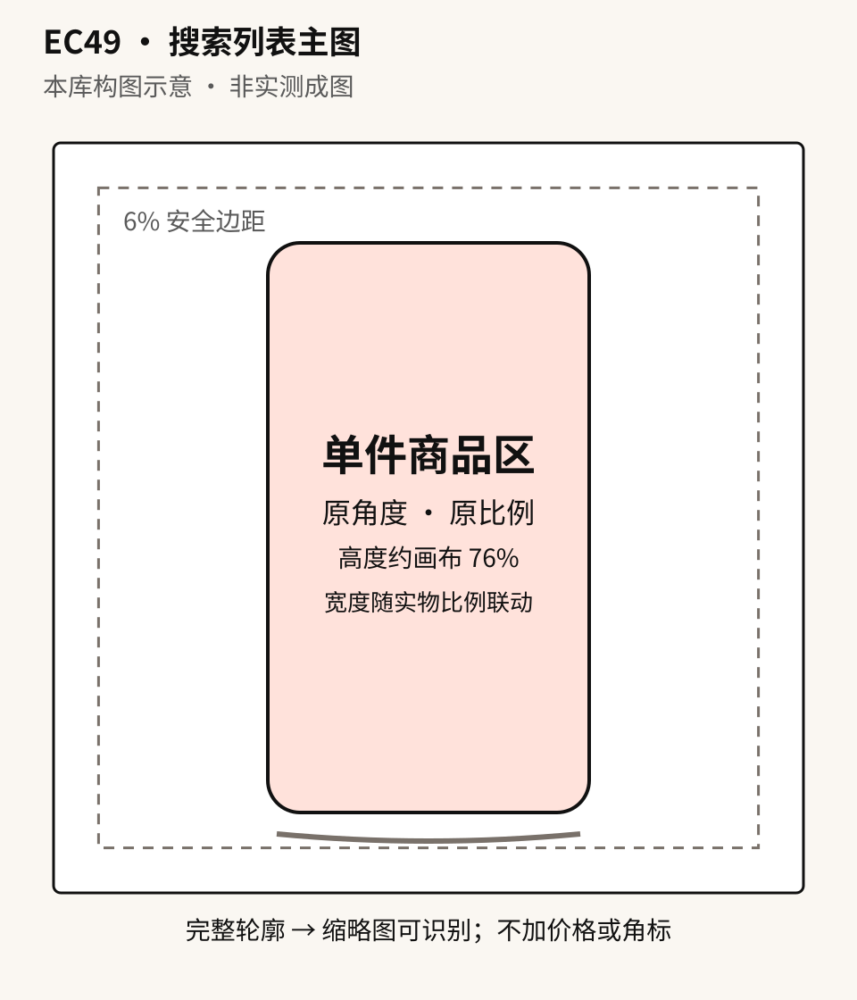

# EC49 · 搜索列表主图主体占比与缩略图可读性

[全部提示词](../README.md) · [首页](../../README.md)

**分类：商品主图 · 本库原创设计**

在方形搜索缩略图里锁定单件商品的占比、完整轮廓和视觉中心，避免主体过小或被角标安全区遮挡。

## 准备材料与变量

图1必需：单件商品同一SKU的完整清晰原照，保留原拍摄角度。图2可选：同一SKU标签或识别细节近照，只用于核对图1已可见区域。另用文字或截图提供发布端真实覆盖区域；未提供时安全区填“无平台专用占位，仅四周留边”。

将下表中的值按实际任务填写，然后复制正文。示例值用于说明填写方式，不是已核实的商品事实。

| 变量 | 填写示例或说明 |
| --- | --- |
| `{{商品信息}}` | 米白色双提手帆布包，以图1可见外观为准 |
| `{{主体占比}}` | 商品含提手外接框高度约76%，宽度按原图比例联动，不超过80% |
| `{{安全区}}` | 无平台专用占位，仅四周至少6%纯背景；已知覆盖区时另按真实位置留空 |
| `{{背景}}` | 纯白无地平线 |

## 拿来就用的具体示例

只上传一张完整清晰的米白双提手帆布包原照即可。此示例没有平台专用占位；有真实覆盖区时改用变量模板。

按示例准备对应素材后，直接复制下段；其他商品使用后面的变量模板。

```text
制作一张1:1纯白搜索主图。图1是米白色双提手帆布包的唯一商品依据，沿用原角度和原比例，不补背面或额外肩带。含提手的完整外接框高度约76%，宽度按原比例联动且不超过80%；四周至少6%纯白留边，完整保留双提手、敞口、侧边和包底。只能等比例缩放，不拉伸商品；商品过宽时缩小并保留完整轮廓。底部保留轻柔接触阴影，不加角标、文字、道具、第二只包或平台标志。不可辨认的原标识不补字，不输出缩略图拼版。只输出一张主图。
```


## 完整提示词

```text
制作一张1:1搜索列表商品主图。图1定义{{商品信息}}的完整轮廓、原拍摄角度、结构、颜色和可见材质；仅在实际附图2时，用它核对图1已经可见的识别细节，不切换角度或补造隐藏面。主体为单件商品，{{主体占比}}；只能等比例缩放，不同时强压宽高，不拉长提手或压扁包体。商品完整留边，底部短而轻柔的接触阴影。背景为{{背景}}，安全区为{{安全区}}，对应区域不放商品、投影、文字或道具。若主体占比与安全区冲突，优先完整轮廓和真实比例，再等比例缩小，不变形腾位置。

保留图1中的商品本色、缝线和原标识；不可辨认的包装字不补写。不得裁掉提手、底边和侧缘，不复制商品，不增加角标、价格、销量、赠品或平台标志。构图以缩略图轮廓清楚为目标，但120像素缩略检查由输出后人工进行，不在成图里生成小图或检查框。只输出一张完成主图。
```

## 参数设置

建议画布：`1024x1024`；模型选择及格式见[模型说明](../../guides/models.md)。网页版可按相同比例描述画布。

仅图1即可使用；细节近照和平台占位只在实际提供时引用。百分比是构图目标，不是模型测量保证；输出后用设计工具核对比例、留边并缩到120像素看轮廓。平台专用区域不凭经验猜，商品身份和完整轮廓优先。


修改前，将修改指令中的双花括号内容按实际问题填写；每次只处理一个位置。

## 接着修改

上传上一轮结果；涉及商品或人物时，同时保留原始参考图。

```text
以本轮成片为底图，重新附图1原商品照。本轮唯一修改是{{主体等比例缩放、整体位置或安全区中的一项}}，目标为{{准确值或区域}}；其余构图、原角度、商品结构与颜色、标签和背景不变。若不能满足真实比例与完整留边，不拉伸或裁切来凑数；只输出一张修改稿。
```

## 来源

- [官方 GPT Image 2.5 提示词指南](https://developers.openai.com/api/docs/guides/image-prompting)

本库构图示意 · 非实测成图



整理日期：2026-10-01。上游许可及第三方素材边界见[署名说明](../../ATTRIBUTIONS.md)。
