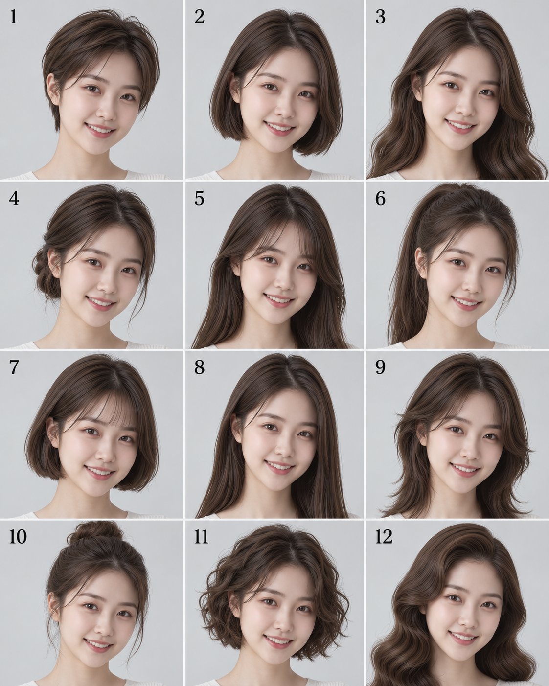

# G05 · 同一人十二款发型

[全部提示词](../README.md) · [首页](../../README.md)

**分类：Characters & People · 精选旧案例改写**

同一人十二款发型

## 准备材料与变量

上传一张面部清楚、头部完整的人像照片。

本卡没有文字变量，准备好正文要求的参考图即可复制。


## 完整提示词

```text
请根据我上传的人物照片，生成一张4:5竖版发型目录，3列4行，共12格，从左上到右下编号1至12。
所有格子均为同一个人，保持面部特征、表情、肤色、服装、发色、妆容和配饰一致，背景统一为浅灰摄影棚。只改变头发的长度与造型。
12款发型依次为：精灵短发、齐下巴波波头、长波浪、低盘发、帘式刘海、马尾、法式波波头、长直发、狼尾、发髻、短卷发、复古大波浪。
每格使用相同机位与柔和灯光，头部完整，间距一致。只标编号，不添加其他文字。直接生成图片。
```

## 参数设置

建议画布：`1536x1920`；模型选择及格式见[模型说明](../../guides/models.md)。网页版可按相同比例描述画布。


修改前，将修改指令中的双花括号内容按实际问题填写；每次只处理一个位置。

## 接着修改

上传上一轮结果；涉及商品或人物时，同时保留原始参考图。

```text
以上一轮结果为底图，重新附所需原始参考。本轮只修改发型目录第{{格号}}格的头发：改成{{指定发型}}，保留该人物五官、肤色、服装以及其他十一格。只输出这一张修改后的图。
```

## 来源

- [原库 Case 535 · 同一人脸十二款发型 Lookbook · @Ciri_ai](https://github.com/wangge-dev/awesome-gpt-image-2/blob/b477278bb2a36d4c59655eb0daa4ce48e8dbc4c4/docs/gallery-part-2.md#case-535)
- [原作者发布来源（模型归属以原帖为准）](https://x.com/Ciri_ai/status/2092452220768002400)

生成示例 · wangge-dev / ChatGPT 网页版



整理日期：2026-09-09。上游许可及第三方素材边界见[署名说明](../../ATTRIBUTIONS.md)。
