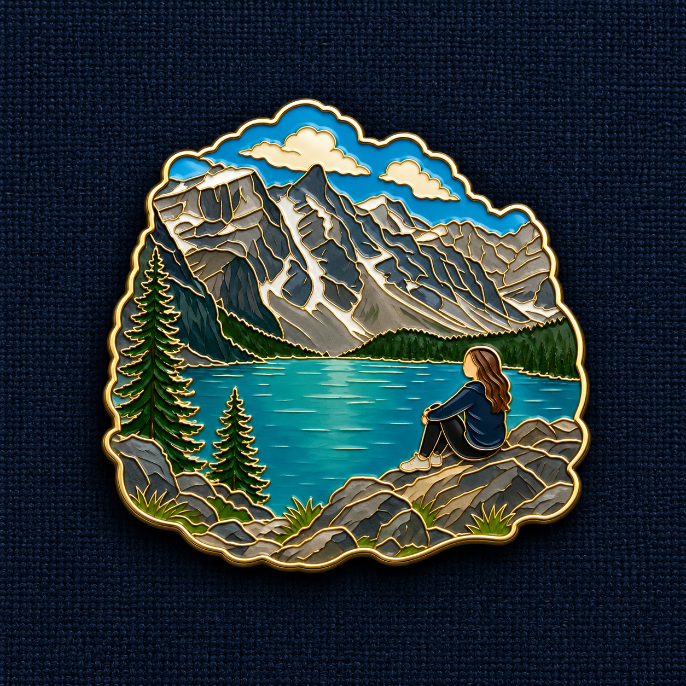

# G21 · 旅行纪念珐琅徽章

[全部提示词](../README.md) · [首页](../../README.md)

**分类：Products & E-commerce · 精选旧案例改写**

旅行纪念珐琅徽章

## 准备材料与变量

上传一张旅行风景照或人物与风景合照。

本卡没有文字变量，准备好正文要求的参考图即可复制。


## 完整提示词

```text
请把我上传的旅行照片转成一枚旅行纪念珐琅徽章，生成1:1方形图片。
让照片中的地形、风景或地标构成徽章主体和异形外轮廓。如果照片有人物，将人物保留为场景中的较小角色，不要改成单人人像徽章。
用细金色金属线分隔珐琅色块，保留照片中的主要颜色、人物服装、发色和自然肤色。珐琅表面细腻光亮，有真实厚度和柔和反光。
徽章居中放在深蓝色粗织布上，占画面约60%，四周留白，底部有自然接触阴影。不要矩形相框，不添加文字。直接生成图片。
```

## 参数设置

建议画布：`1024x1024`；模型选择及格式见[模型说明](../../guides/models.md)。网页版可按相同比例描述画布。


修改前，将修改指令中的双花括号内容按实际问题填写；每次只处理一个位置。

## 接着修改

上传上一轮结果；涉及商品或人物时，同时保留原始参考图。

```text
以上一轮结果为底图，重新附所需原始参考。本轮只修改徽章中的{{人物或地标部位}}：依旅行原图恢复{{识别特征}}，保留异形边缘、金线与深蓝布底。只输出这一张修改后的图。
```

## 来源

- [原库 Case 543 · 旅行纪念珐琅徽章 · @Emmma__0](https://github.com/wangge-dev/awesome-gpt-image-2/blob/b477278bb2a36d4c59655eb0daa4ce48e8dbc4c4/docs/gallery-part-2.md#case-543)
- [原作者发布来源（模型归属以原帖为准）](https://x.com/Emmma__0/status/2093194689222705645)

生成示例 · wangge-dev / ChatGPT 网页版



整理日期：2026-09-09。上游许可及第三方素材边界见[署名说明](../../ATTRIBUTIONS.md)。
